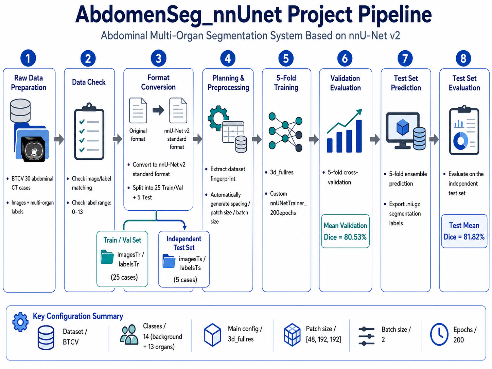
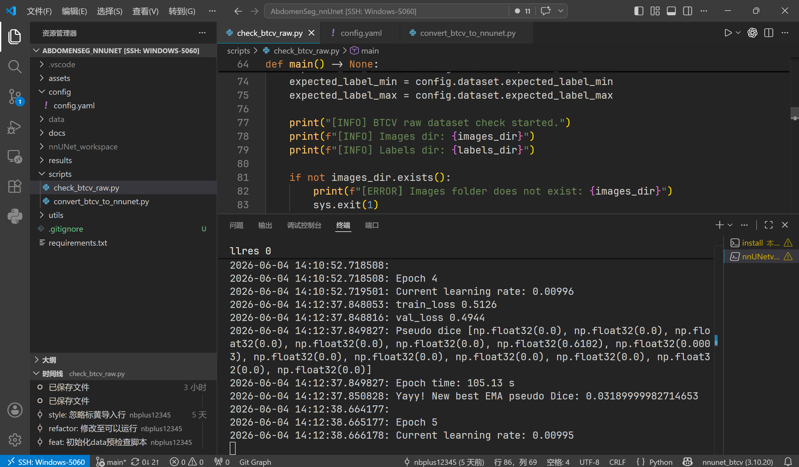

# AbdomenSeg_nnUnet：基于 nnU-Net v2 的腹部多器官分割系统
[English](./README.md) | [简体中文](./README_zh-CN.md)

[](LICENSE)

[](https://pytorch.org/)


## 项目简介

本项目基于 **BTCV 30 例腹部 CT 多器官分割数据集**，使用 **nnU-Net v2** 完成腹部多器官分割任务。

项目完整实践了 nnU-Net v2 从数据格式转换、数据完整性检查、dataset fingerprint 提取、experiment planning、自动预处理、5-fold cross-validation 训练、验证评估、测试集预测到分割结果可视化的端到端流程。

本项目的重点不是手写一个新的 U-Net 网络，而是理解并复现 nnU-Net 作为医学图像分割领域经典 **self-configuring framework** 的完整工作流。

## 项目亮点

- **完整 nnU-Net v2 流程实践**：数据检查、格式转换、5-fold 训练及预测。
- **标准医学影像分割数据组织**：构建 `Dataset501_BTCV`，包含 `imagesTr`、`labelsTr`、`imagesTs`、`labelsTs` 和 `dataset.json`。  
- **5-fold 交叉验证 + 独立测试集**：25 例用于 5-fold cross-validation，5 例作为独立测试集。  
- **自定义 200 epoch trainer**：针对小样本实验将默认 1000 epochs 调整为 200 epochs，提高实验效率。  

## 快速预览

### 分割效果

> 左侧为原始 CT，中间为 Ground Truth，右侧为 Prediction。


### 项目流程



### 运行过程



---

## 项目结构

```text
AbdomenSeg_nnUnet/
├── README.md                              # 项目说明文档
├── LICENSE                                # MIT 开源协议
├── requirements.txt                       # Python 依赖列表
├── config/
│   └── config.yaml                        # 项目路径、数据划分、训练配置
├── data/
│   └── BTCV_raw/
│       ├── images/                        # BTCV 原始 CT 图像，格式为 .nii.gz
│       └── labels/                        # BTCV 原始多器官标签，标签值范围为 0-13
├── nnUNet_workspace/
│   ├── nnUNet_raw/                        # nnU-Net v2 标准 raw 数据目录
│   ├── nnUNet_preprocessed/               # nnU-Net v2 预处理结果目录
│   └── nnUNet_results/                    # nnU-Net v2 训练结果、checkpoint 和验证输出
├── scripts/
│   ├── check_btcv_raw.py                  # 检查原始 BTCV 图像与标签是否匹配
│   ├── convert_btcv_to_nnunet.py          # 转换为 nnU-Net v2 格式，并划分 5 例测试集
│   ├── install_custom_trainer.py          # 注册自定义 200 epoch trainer
│   ├── run_plan_preprocess.py             # 自动设置环境变量并执行 planning + preprocessing
│   └── run_train_5fold.py                 # 按顺序运行 5-fold training
├── utils/
│   ├── config_utils.py                    # YAML 配置读取与点号访问工具
│   └── logger_utils.py                    # 通用日志工具
├── assets/
│   ├── seg_compare.gif                    # 测试集分割效果对比 GIF
│   ├── pipeline.png                       # nnU-Net 项目流程图
│   └── nnunet_training.png                # 训练过程截图
└── results/
    └── test_predictions_5fold/            # 测试集预测输出标签，格式为 .nii.gz
```

## 方法说明

本项目使用 **nnU-Net v2** 作为核心分割框架。

与手动搭建 U-Net、设置 patch size、loss、optimizer 和 scheduler 的训练方式不同，nnU-Net 会根据数据集特征自动完成多项配置：

- 图像 spacing 分析
- intensity statistics 统计
- patch size 自动规划
- batch size 自动规划
- normalization strategy 选择
- 2D / 3D full resolution / 3D low resolution 配置生成
- 训练与验证 fold 划分
- 推理时 sliding window prediction

本项目主要使用 nnU-Net v2 生成的 `3d_fullres` 配置进行训练和推理。

当前自动规划出的关键配置如下：

```text
Configuration: 3d_fullres
Network: PlainConvUNet
Input modality: CT
Patch size: [48, 192, 192]
Batch size: 2
Normalization: CTNormalization
Training epochs: 200
```

## 结果与性能

数据集划分与结果如下：

| Split       | Cases | Mean Dice |
| ----------- | ----: | --------: |
| Train / Val |    25 |    80.53% |
| Test        |     5 |    81.82% |

_Train / Val 的 Mean Dice 指 25 例训练验证数据上 5-fold cross-validation 的平均验证 Dice；Test 的 Mean Dice 指 5 例独立测试集上的平均 Dice。_

## 环境配置

本项目已在以下环境完成运行测试：

| 操作系统                           | 计算设备 / GPU                 | 硬件后端 | 版本                     |
| :----------------------------- | :------------------------- | :--- | :--------------------- |
| **Windows 11**                 | NVIDIA RTX 5060 8G         | CUDA | PyTorch-2.8.0+cu128    |
| **Linux (Ubuntu 24.04.4 LTS)** | AMD Radeon RX 7900 XTX 24G | ROCm | PyTorch-2.11.0+rocm7.2 |

我们推荐使用 Conda 管理环境，具体命令如下：

### 1、克隆仓库

```bash
git clone https://github.com/nbplus12345/AbdomenSeg_nnUnet.git
cd AbdomenSeg_nnUnet
```

### 2、创建激活conda环境

```bash
conda create -n abdomenseg_nnunet python=3.10 -y
conda activate abdomenseg_nnunet
```

### 3. 安装核心深度学习框架 (PyTorch)

请根据你电脑的硬件情况，选择以下【其中一种】方式安装 PyTorch：

- NVIDIA CUDA 用户可参考：

```Bash
pip3 install torch torchvision --index-url https://download.pytorch.org/whl/cu128
```

- AMD ROCm 用户请根据 PyTorch 官方安装页面选择与本机驱动和 ROCm 版本匹配的安装命令，例如：

```Bash
pip install torch torchvision torchaudio --index-url https://download.pytorch.org/whl/rocm7.2
```

- CPU 或 Mac 用户可以直接安装 CPU 版本 PyTorch，速度会明显慢于 GPU 环境。

### 4、安装项目剩余依赖

```bash
pip install -r requirements.txt
```

## 数据集准备

本项目使用 **BTCV (Beyond the Cranial Vault)** 腹部多器官分割数据集中的 30 例带标注训练数据。该数据集为腹部 CT 多器官分割任务，标签包含背景类与 13 个腹部器官类别。  
  
本项目首先将 BTCV 原始数据转换为 nnU-Net v2 要求的标准格式，然后由 nnU-Net v2 在训练阶段基于 fold 机制完成交叉验证。

1. 请前往 [Kaggle - BTCV Dataset](https://www.kaggle.com/) 或官方 [Synapse 平台](https://www.synapse.org/) 下载 BTCV 的训练集数据（请确认下载的是 BTCV training raw data，标签应为 0-13 的多类别 label，而不是二值标签）。
2. 下载并解压后，请将图像文件夹与标签文件夹分别重命名为 `images` 和 `labels`，并放入项目的 `data/` 目录下，初始数据目录结构应如下所示：

```Plaintext
data/  
└── BTCV_raw/  
 ├── images/ # BTCV 原始 CT 图像，格式为 .nii.gz  
 │   ├── img0001.nii.gz  
 │   ├── img0002.nii.gz  
 │   └── ...  
 └── labels/ # BTCV 原始多器官标签，标签值范围为 0-13  
     ├── label0001.nii.gz  
     ├── label0002.nii.gz  
     └── ...
```

1. 随后运行数据集预检查脚本，该脚本自动检查数据集的完整性：

```Bash
python scripts/check_btcv_raw.py --config config/config.yaml
```

1. 随后运行数据集转换脚本，该脚本采用固定随机种子划分数据，自动将原始数据集转化为 nnU-Net v2 要求的格式，并分出5例测试集：

```Bash
python scripts/convert_btcv_to_nnunet.py --config config/config.yaml
```

>其中，25 例训练数据进一步用于 nnU-Net v2 的 5-fold cross-validation，每折用20例训练，5例用于验证。
>独立测试集 5 例仅用于最终推理和测试评估，不参与训练和验证。

## 训练与测试

### 1. 安装自定义 200 epoch trainer

nnU-Net v2 默认训练轮数较长。对于本项目的小规模 BTCV 实验，提供了自定义 trainer，将最大训练轮数调整为 200 epochs。

```shell
python scripts/install_custom_trainer.py
```

安装后训练时使用：

```
-tr nnUNetTrainer_200epochs
```

### 2. Planning and Preprocessing

运行预处理脚本：

```shell
python scripts/run_plan_preprocess.py --config config/config.yaml
```

该脚本会自动设置 nnU-Net v2 所需环境变量，并执行：

```shell
nnUNetv2_plan_and_preprocess -d 501 --verify_dataset_integrity
```

该步骤会完成：

- 数据完整性检查
- dataset fingerprint 提取
- experiment planning
- 预处理数据生成

### 3. 5-fold 训练

项目中的主要参数集中在 `config/config.yaml` 中，包括数据路径、折数、断点续训、trainer类型等。训练命令如下：

```Bash
python scripts/run_train_5fold.py --config config/config.yaml
```

该脚本会按顺序训练：

```
fold 0 → fold 1 → fold 2 → fold 3 → fold 4
```

如果训练中断，可在 `config.yaml` 中设置：

```
training:  
 continue_training: true
```

### 4. 验证

使用 5-fold cross-validation 进行内部验证：

```Bash
nnUNetv2_find_best_configuration 501 -c 3d_fullres -tr nnUNetTrainer_200epochs
```

说明：

- 该指标为 25 例训练验证数据上的 5-fold cross-validation 结果。
- 独立测试集不参与该分数计算。

### 5. 测试集预测

完成 5-fold 训练后，可对独立测试集进行预测：

```Bash
nnUNetv2_predict \
  -i ./nnUNet_workspace/nnUNet_raw/Dataset501_BTCV/imagesTs \
  -o ./results/test_predictions_5fold \
  -d 501 \
  -c 3d_fullres \
  -f 0 1 2 3 4 \
  -tr nnUNetTrainer_200epochs \
  -p nnUNetPlans \
  -npp 1 \
  -nps 1
```

输出结果为 `.nii.gz` segmentation label，可使用 ITK-SNAP、3D Slicer 或 Python 可视化。

```
results/
└── test_predictions_5fold/    
 ├── BTCV_00xx.nii.gz    
 ├── BTCV_00xx.nii.gz    
 └── ...
```

### 6. 测试集评估  
  
预测完成后，可以使用 `labelsTs` 作为 ground truth，对 `test_predictions_5fold` 中的预测标签计算测试集 Dice：  
  
```Bash  
nnUNetv2_evaluate_folder \  
./nnUNet_workspace/nnUNet_raw/Dataset501_BTCV/labelsTs \  
./results/test_predictions_5fold \  
-djfile ./nnUNet_workspace/nnUNet_raw/Dataset501_BTCV/dataset.json \  
-pfile ./nnUNet_workspace/nnUNet_preprocessed/Dataset501_BTCV/nnUNetPlans.json \  
-o ./results/test_predictions_5fold/summary.json \  
-np 1
```

评估完成后会生成：

```
results/test_predictions_5fold/summary.json
```

## 局限

- **数据规模较小**  
    BTCV 训练集仅包含 30 例带标注数据。本项目划分 25 例用于 5-fold cross-validation，5 例作为独立测试集，样本量仍然有限。
- **测试集规模有限**  
    独立测试集只有 5 例，因此测试结果只能作为项目实验参考，不能代表严格泛化性能。
- **未与其他方法系统对比**  
    本项目重点是复现和理解 nnU-Net v2 流程，尚未与 TransUNet、UNETR、SwinUNETR 等模型进行系统对比。
- **未进行外部数据集验证**  
    当前实验仅基于 BTCV 数据集，没有在其他腹部 CT 数据集上验证模型泛化能力。
- **工程部署仍可扩展**  
    当前主要完成训练、验证和 NIfTI 标签预测，尚未进行模型部署、推理加速、TensorRT 或临床工作流集成。

## 总结

本项目完成了基于 nnU-Net v2 的 BTCV 腹部多器官分割实验，包括数据检查、格式转换、自动预处理、5-fold cross-validation、测试集预测和分割结果可视化。

该项目主要用于学习和展示 nnU-Net v2 在 3D 医学影像分割任务中的标准使用流程，以及小样本医学图像分割实验的完整工程实践。

## 开源协议

本项目基于 MIT License 开源，允许自由使用、修改和分发。详细条款请见 [LICENSE](./LICENSE) 文件。
